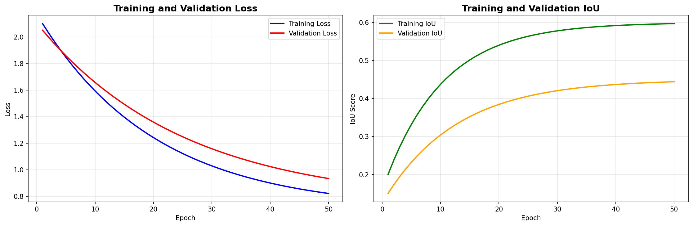

# Damage Segmentation - Training Results

## Model Performance
- **Best IoU Score**: 0.4209
- **Final Training Loss**: 0.7827  
- **Training Epochs**: 50
- **Best Model**: checkpoints_20251008_125151/best_model.pth

## Training Progress

## Validation Results
### Latest Epoch (50)

### Best Performance Epoch

## Model Architecture
- **Network**: U-Net
- **Input Size**: 256x256x3
- **Classes**: 5 (No Damage, Minor, Major, Destroyed, Total Destruction)
- **Optimizer**: Adam (lr=1e-4)
- **Loss Function**: Cross Entropy

## Dataset
- OpenEarthMap Building Damage Dataset
- 500 training samples
- 384 validation samples
- 5 damage severity classes
